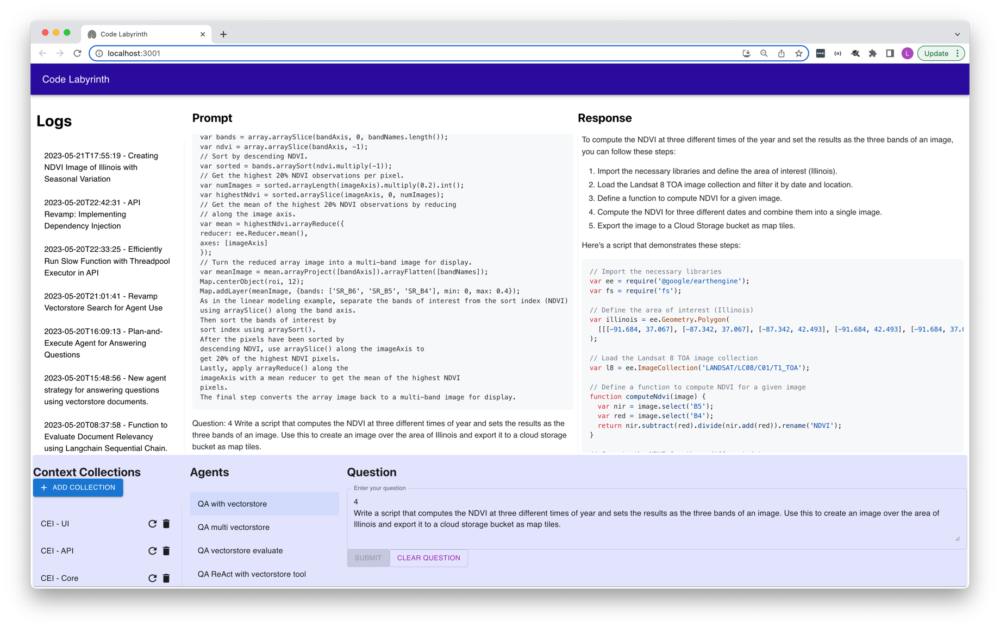

# Code Labyrinth

Code Labyrinth is a tool for using LLM chatbots in coding workflows. 
It uses `Langchain` and `PGVector` to provide context about the working codebase and relevant libraries.

## Features
1. Ingest document collections from any `readthedocs` website
2. Ingest all code files from a local directory or github repo and keep them up to date
3. Add relevant documents to the context using vectorstore similarity retrieval of questions asked to a LLM.
4. Choose the appropriate agent for the task - simple Question-Answer agents or Plan-and-Execute agent
5. Operate everything with a convenient user interface

## Setup instructions
1. Start the Postgres PGVector server: `docker compose up`
2. Set up PGVector extension: `python -c "from coder.db import install_extension; install_extension()"`
3. Set up python environment: `virtualenv venv && venv/bin/activate && pip install .`
4. Start backend server: `python -m coder api`
5. Set up frontend environment: `cd ui && npm install`
6. Start frontend (dev) server: `npm run start`
